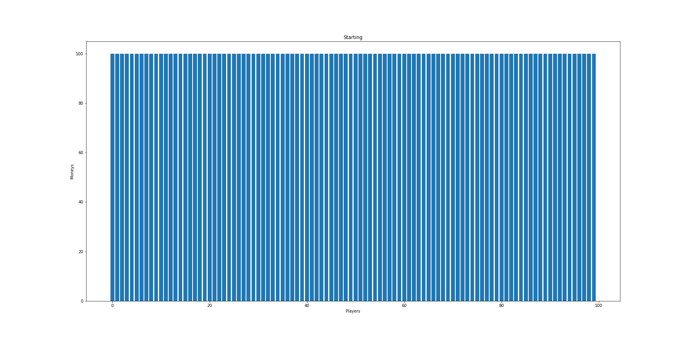
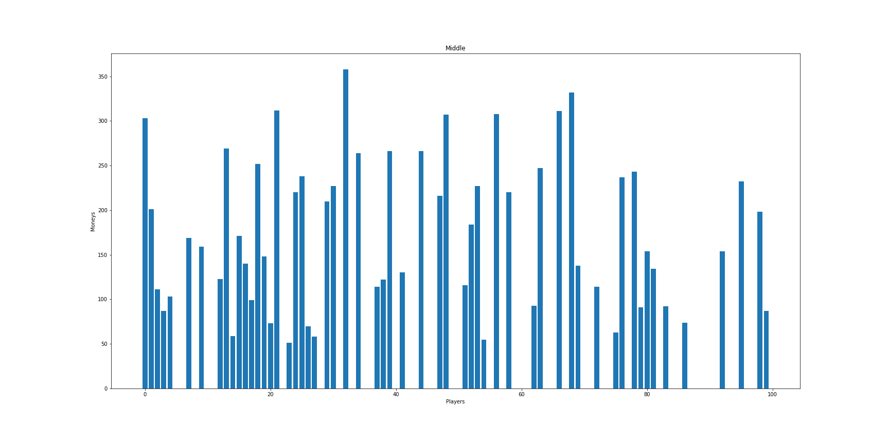
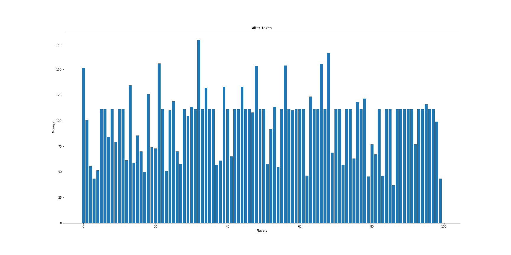
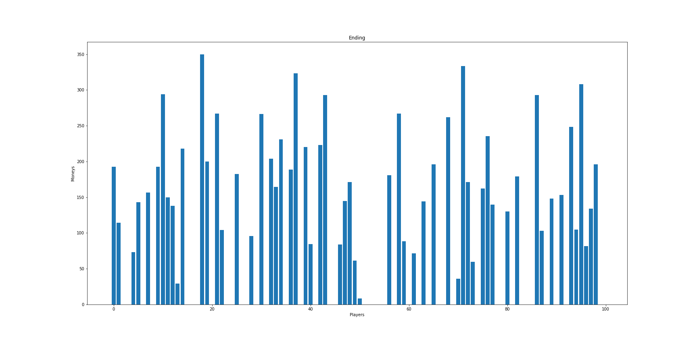

# Pareto distribution bet game

## Introduction

The [Pareto distribution](https://en.wikipedia.org/wiki/Pareto_distribution) is a probability distribution that is often used to describe the distribution of wealth in a population. It is also known as the 80/20 rule, as it states that 80% of the outcome are due to 20% of the causes. The goal is to simulate [this](https://www.youtube.com/watch?v=TcEWRykSgwE) experiment that [Dr Jordan B Peterson](https://www.jordanbpeterson.com/) uses to teach his students about the Pareto principle.

## Software and Libraries

This project uses Python 3.9.2 and the following libraries:
* [Pandas](https://pandas.pydata.org/)
* [Numpy](https://numpy.org/)
* [matplotlib](https://pypi.org/project/matplotlib/)

## Running the code

The code is provided in the form of a [Jupyter](https://jupyter.org/) Notebook `bet_game.ipynb`

## Results

We have been able to simulate the experiment and the results are as expected. At the beginning the distribution of money is uniform between the players:

After a betting cycle the distribution of money is pretty unequal and a lot of players have 0 money

Just for fun now let's apply a tax to the rich players and redistribute some money to the broke players:

End if we run again a betting cycle

We can also check the evolution of every palyer moneys:

You can find more information in this [blog post](https://simone-rigoni01.medium.com/the-pareto-distribution-b32fe9991deb)

## Acknowledgements

Thanks [Dr Jordan B Peterson](https://www.jordanbpeterson.com/) for the wonderful lectures and the idea of this experiment.
