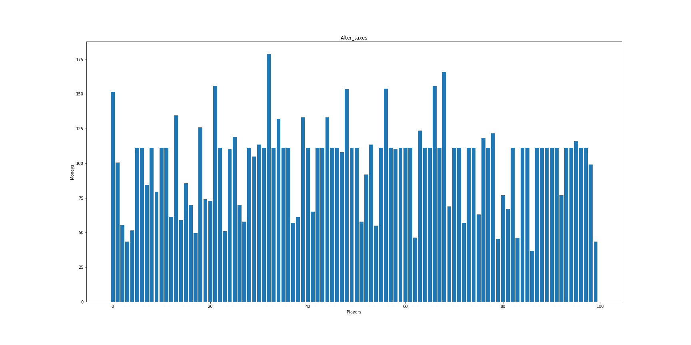
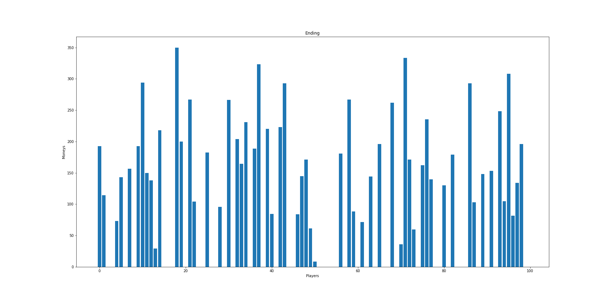
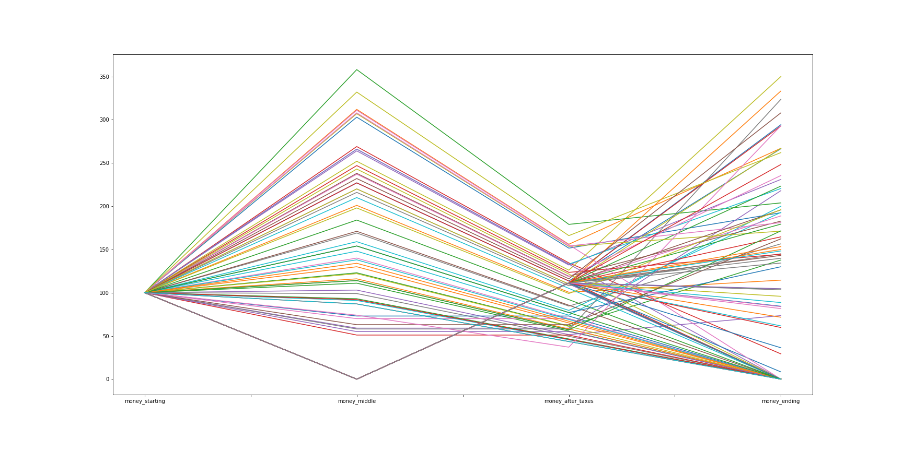

# Pareto distribution bet game

## Introduction

The [Pareto distribution](https://en.wikipedia.org/wiki/Pareto_distribution) is a probability distribution that is often used to describe the distribution of wealth in a population. It is also known as the 80/20 rule, as it states that 80% of the outcome are due to 20% of the causes. The goal is to simulate [this](https://www.youtube.com/watch?v=TcEWRykSgwE) experiment that [Dr Jordan B Peterson](https://www.jordanbpeterson.com/) uses to teach his students about the Pareto principle.

## Software and Libraries

This project uses Python 3.9.2 and the following libraries:
* [Pandas](https://pandas.pydata.org/)
* [Numpy](https://numpy.org/)
* [matplotlib](https://pypi.org/project/matplotlib/)

## Pre-commit

[Pre-commit](https://pre-commit.com/) is a framework for managing and maintaining multi-language pre-commit hooks. A pre-commit hook is a script that runs before a commit operation in a version control system. This allows to shift left code quality checks.

To launch the pre-commit hooks without an actual commit `pre-commit run`.

## Data

Have a look at the `data` folder and its [DATA.md](data/DATA.md) file.

## Testing

No test implemented.

## Running the code

The code is provided in the form of a [Jupyter](https://jupyter.org/) Notebook `bet_game.ipynb`

## Results

We have been able to simulate the experiment and the results are as expected. At the beginning the distribution of money is uniform between the players:

After a betting cycle the distribution of money is pretty unequal and a lot of players have 0 money

Just for fun now let's apply a tax to the rich players and redistribute some money to the broke players:

End if we run again a betting cycle

We can also check the evolution of every palyer moneys:

You can find more information in this [blog post](https://simone-rigoni01.medium.com/the-pareto-distribution-b32fe9991deb)

## List of activities

In the [TODO.md](TODO.md) file you can find the list of tasks and on going activities.

## Licensing and acknowledgements

Have a look at [LICENSE.md](LICENSE.md) and thanks [Dr Jordan B Peterson](https://www.jordanbpeterson.com/) for the wonderful lectures and the idea of this experiment.

## Outro

I hope this repository was interesting and thank you for taking the time to check it out. On my Medium you can find a more in depth [story](https://medium.com/@simone-rigoni01/) and on my Blogspot you can find the same [post](https://simonerigoni01.blogspot.com/) in italian. Let me know if you have any question and if you like the content that I create feel free to [buy me a coffee](https://www.buymeacoffee.com/simonerigoni).